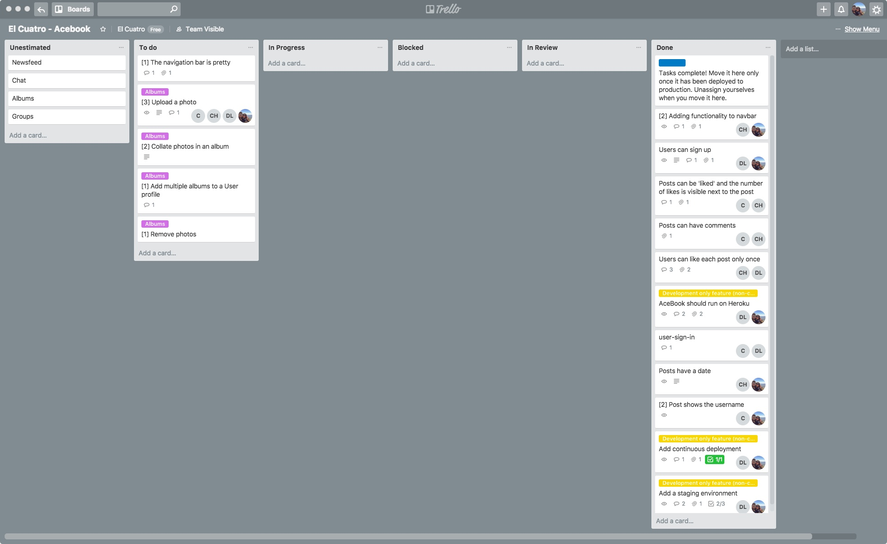

# AceBook [](https://travis-ci.org/y0m0/Acebook)

This is a Ruby on Rails Week Project, when we were first introduced to Ruby on Rails. The Ruby on Rails scaffolding was me meant to be an introduction to some legacy code and we would build on top of it.

In this case, it was a Facebook clone where we would be given features to build on top.

## Quickstart

First, clone this repository. Then:

```bash
cd Acebook
bundle install # Install dependencies
rails db:create
rails db:migrate

rspec # Run the tests to ensure it works
rails server # Start the server at localhost:3000
```

# Development

This was the first time we were ever introduced to a Ruby on Rails application and in a matter of a week we made progress to complete a few of the features asked.

While developing on top of the application we practise Agile Methodologies, dividing the work in pairs, organising our own stand-ups, and retros by the end of the week.



# Collaboration

This amazing **hard working people** were involved the development:

- [Christopher Harrop](https://github.com/bannastre)
- [Charlotte Feather](https://github.com/Charliefea)
- [Daniele Lixi](https://github.com/y0m0)

# Tech Stack

- Ruby
- Ruby on Rails
- Rspec for Unit Testing
- [Travis CI](https://travis-ci.org/) for Continuous integration
- PostgreSQL
- FactoryGirl (Now formally called [FactoryBot](https://github.com/thoughtbot/factory_bot))
